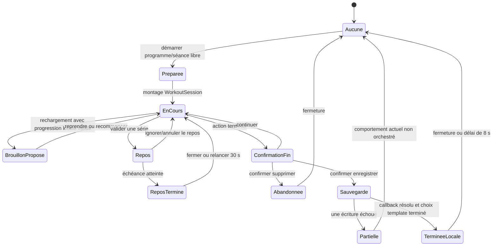

# Cycle de vie actuel de `WorkoutSession`

## Statut et portée

**Statut : audit du comportement legacy observé le 18 juillet 2026.**

Ce document décrit le fonctionnement réellement présent avant l'extraction du
modèle pur de séance. Il complète l'[inventaire Training](TRAINING_FORMATS_INVENTORY.md),
le [modèle canonique cible](TRAINING_CANONICAL_MODEL.md), les
[adaptateurs legacy](TRAINING_LEGACY_ADAPTERS.md), l'[historique des séances](TRAINING_SESSION_HISTORY.md)
et l'[architecture de `TrainingTab`](TRAINING_TAB_ARCHITECTURE.md). Il ne définit
pas encore une machine à états exécutable et ne modifie ni données ni RLS.

Deux flux coexistent :

1. `WorkoutSession` plein écran, lancé par `useClientDashboardActions`, conserve
   une enveloppe dans `moovx_active_workout`, une progression détaillée dans
   `moovx_workout_draft`, puis écrit `workout_sessions` et `workout_sets` ;
2. la séance rapide interne à `TrainingTabController` utilise les clés
   `moovx-sets-YYYY-MM-DD-<exercise>` et
   `moovx-inputs-YYYY-MM-DD-<exercise>`, puis écrit seulement une ligne
   `workout_sessions`.

Ces flux ne sont pas fusionnés dans cet audit. La machine ci-dessous décrit le
premier ; les divergences du second sont signalées explicitement.

## Vocabulaire observable

| État observé | Critère actuel | Autorité effective | Remarque |
|---|---|---|---|
| Aucune séance | `workoutSession === null` | mémoire React de `useClientDashboard` | État initial en l'absence de restauration locale. |
| Séance préparée | `startProgramWorkout` a produit `{ name, exercises, startedAt, weekdayKey? }` | mémoire React + `moovx_active_workout` | Il n'existe pas encore d'identifiant de `workout_sessions`. |
| Brouillon local proposé | `moovx_workout_draft` correspond au même `sessionName`, date de moins de 24 h, contient au moins une série `done` | `localStorage` | La clé n'est ni liée à l'utilisateur ni versionnée. Le brouillon n'est pas repris silencieusement : un choix reprendre/recommencer est affiché. |
| Séance en cours | `WorkoutSession` monté avec ses exercices et `done === false` | mémoire React (`exos`, séries, `elapsed`) ; copie asynchrone dans `moovx_workout_draft` | Aucun enregistrement serveur n'est créé pendant l'exécution. |
| Repos actif | `restOn === true` | mémoire React, échéance `restEndsAtRef` | Le temps restant est recalculé avec `Date.now()` au retour de visibilité. Il n'est pas persisté. |
| Repos terminé | `restDone === true` | mémoire React | État transitoire fermé après cinq secondes ou action utilisateur. |
| Confirmation de fin | `showEndModal === true` | mémoire React | L'utilisateur peut continuer, supprimer localement ou demander la sauvegarde. |
| Sauvegarde déclenchée | appel de `onFinish` après suppression du brouillon | chaîne asynchrone côté client | Il n'existe ni état persistant `saving`, ni transaction globale, ni verrou anti-double soumission. |
| Séance terminée locale | `done === true` | mémoire React | Atteint après le choix concernant le template, puis fermeture automatique après huit secondes. Ce drapeau ne prouve pas que toutes les écritures serveur ont réussi. |
| Abandon explicite | confirmation de suppression | mémoire React + suppression de `moovx_workout_draft` et, via `onClose`, de `moovx_active_workout` | Aucune ligne d'abandon n'est persistée. Fermer/recharger sans cette confirmation laisse au contraire les clés de reprise. |
| Erreur partielle | une étape de la finalisation échoue après une étape précédente | état dispersé entre base, cache local et logs | Aucun état UI discriminé ne représente cette situation aujourd'hui. |

`prepared`, `in-progress`, `saving`, `completed`, `abandoned` et
`partial-error` sont ici des noms d'audit. Ils ne sont pas des valeurs stockées
dans une colonne d'état unique.

## Diagramme d'état observé

La transition `Sauvegarde -> TermineeLocale` n'est pas atomique : `finish()`
n'attend pas la promesse retournée par `onFinish`, et la fenêtre de sauvegarde
comme template peut être affichée pendant que les écritures métier continuent.

## Table des transitions

| De | Déclencheur | Préconditions observées | Écritures / effets | Vers | Échec actuel |
|---|---|---|---|---|---|
| Aucune | `startProgramWorkout(day, exercises, weekdayKey?)` | appelant possède une session chargée ; l'identité n'est pas fournie par le jour | crée `startedAt`, met l'état React et `moovx_active_workout` | Préparée | un échec `localStorage` est ignoré ; la séance reste en mémoire |
| Préparée | rendu plein écran | `workoutSession` non nul | transforme les exercices legacy en `Exo[]`, démarre durée et wake lock | En cours | champs absents reçoivent des défauts legacy |
| En cours | effet initial | brouillon même `sessionName`, `savedAt` < 24 h, `exos` valides et au moins une série faite | ouvre le prompt | Brouillon proposé | JSON invalide, ancien ou autre nom est ignoré, sans suppression systématique |
| Brouillon proposé | reprendre | brouillon présent | clone les exercices/séries et restaure `weightRaw` | En cours | l'enveloppe `moovx_active_workout` reste indépendante |
| Brouillon proposé | recommencer | aucune | supprime `moovx_workout_draft` | En cours | aucune écriture serveur |
| En cours | modifier charge/répétitions, ajouter/enlever/réordonner exercice ou série | séance montée | met à jour `exos`; l'effet réécrit tout le brouillon | En cours | pas de validation de schéma/version du brouillon |
| En cours | valider une série | répétitions <= 15 ou confirmation explicite | commit de charge, `done=true`, démarrage du repos | Repos | aucune persistance serveur intermédiaire |
| Repos | ignorer, invalider la série ou annuler | repos actif | annule sons/intervalle et efface le contexte de repos | En cours | état de repos perdu au rechargement |
| Repos | échéance calculée atteinte | `restEndsAtRef <= Date.now()` | bip/vibration, message et `restDone=true` | Repos terminé | dépend des capacités navigateur ; progression de séance reste intacte |
| En cours | terminer | aucune obligation `allDone` observée | ouvre le récapitulatif de confirmation | Confirmation de fin | une séance partielle peut être finalisée |
| Confirmation de fin | continuer | aucune | ferme la modale | En cours | aucun effet persistant |
| Confirmation de fin | supprimer puis confirmer | aucune | supprime `moovx_workout_draft`, appelle `onClose`, qui supprime `moovx_active_workout` | Abandonnée puis Aucune | aucune trace serveur d'abandon |
| Confirmation de fin | enregistrer | si séance modifiée, choix préalable « sauvegarder les modifications / cette fois » | `finish()` arrête le compteur, supprime le brouillon et appelle `onFinish` | Sauvegarde | aucun verrou ni attente du callback |
| Sauvegarde | première écriture de `onFinishWorkout` | session Auth encore présente | supprime `moovx_active_workout`; insère `workout_sessions` avec `user_id=session.user.id`, `completed=true` | Sauvegarde | si l'insert échoue, les caches de reprise ont déjà disparu |
| Sauvegarde | session détaillée créée | `savedSession` non nul | marque les planifications du jour, XP/streak, PR, insère `workout_sets`, badges et suggestions | Sauvegarde | étapes séquentielles non transactionnelles ; plusieurs erreurs sont journalisées ou ignorées |
| Sauvegarde | fin commune | session Auth présente | remarque les planifications, met `profiles.last_workout_at`, insère éventuellement `completed_sessions`, recharge le dashboard | Terminée locale | un échec n'annule pas les étapes précédentes ; `completed_sessions` est seulement journalisé en erreur |
| Terminée locale | choix template ou refus, fermeture ou délai | `finish()` déjà appelé | insertion facultative dans `custom_programs`; `done=true`; `onClose` | Aucune | l'échec template n'est pas mappé à un état de séance |

## Sources d'autorité et identité

### Mémoire et stockage local

- `workoutSession` est l'enveloppe de lancement : `name`, `exercises`,
  `startedAt`, `weekdayKey?`.
- `moovx_active_workout` est une copie de cette enveloppe, restaurée au montage
  de `useClientDashboard`. Elle ne contient ni identifiant utilisateur, ni
  version, ni progression détaillée.
- `moovx_workout_draft` contient `sessionName`, `startedAt`, `savedAt` et tout
  `exos`, séries comprises. Sa validité repose sur le nom et une limite de
  24 heures, pas sur l'owner.
- les identifiants d'exercices et de séries en mémoire sont générés avec
  `Math.random`; ils ne deviennent pas les UUID des lignes serveur.
- le repos et son échéance ne sont qu'en mémoire. `startedAt` permet de
  recalculer la durée globale après restauration de l'enveloppe, mais le
  brouillon détaillé ne remplace pas lui-même l'enveloppe active.

Le stockage local est un mécanisme de continuité d'interface, jamais une
preuve d'identité ou d'ownership.

### Tables persistantes

| Table | Rôle actuel | Colonnes utilisées dans ce flux | Ce qu'elle ne prouve pas |
|---|---|---|---|
| `workout_sessions` | historique détaillé racine | `id`, `user_id`, `name`, `completed`, `duration_minutes`, `notes`, `muscles_worked`, `created_at` | ne référence ni programme, ni séance prescrite, ni `scheduled_sessions` |
| `workout_sets` | faits par série rattachés à l'historique détaillé | `session_id`, `user_id`, `exercise_name`, `exercise_id`, `set_number`, `reps`, `weight`, `completed`, `rir`, `created_at` | le nom seul n'est pas une identité canonique ; les séries ne sont écrites qu'à la fin |
| `completed_sessions` | marqueur d'achèvement d'une séance de programme coach | `client_id`, `coach_id`, `program_id`, `session_index`, `session_name`, `duration_minutes`, `completed_at` | ne possède aucune FK vers `workout_sessions`; absence ou présence ne doit pas être fusionnée implicitement |
| `scheduled_sessions` | planification/calendrier et marqueur `completed` | `id`, `user_id`, `coach_id`, `client_id`, `title`, `session_type`, dates/heures, durées, `completed`, `completed_at`, rappel, notes, statut | la finalisation marque toutes les lignes non terminées du jour de l'utilisateur, sans lier une planification précise |

Les écritures `workout_sessions` et `workout_sets` passent par des clients
authentifiés et les policies `*_own` imposent `auth.uid() = user_id`. Le
marqueur `completed_sessions` impose `auth.uid() = client_id`. Dans le code, les
identifiants écrits viennent de `session.user.id`; les métadonnées du programme
ne remplacent pas cette identité.

## Finalisation et échecs partiels

L'ordre réellement observé est :

1. suppression des deux caches locaux (`moovx_workout_draft`, puis
   `moovx_active_workout`) ;
2. insertion de `workout_sessions` ;
3. si elle réussit : première mise à jour des `scheduled_sessions`, XP/streak,
   détection des PR, insertion groupée des `workout_sets`, badges et requêtes
   de suggestion de surcharge ;
4. seconde mise à jour des `scheduled_sessions`, même si la session racine n'a
   pas été créée ;
5. mise à jour de `profiles.last_workout_at` ;
6. insertion facultative de `completed_sessions` pour une affectation coach et
   un `weekdayKey` ;
7. notification de succès et rechargement du dashboard.

Cette chaîne n'est ni transactionnelle ni idempotente. Un double appel peut
créer deux `workout_sessions` et deux marqueurs `completed_sessions`. Une panne
après l'étape 2 peut laisser une session sans séries ; une panne avant l'étape
2 peut néanmoins marquer la planification et le profil, puisque le chemin
commun continue. Les caches de reprise sont supprimés avant confirmation de la
persistance. Aucun statut persistant ne distingue `saving`, `failed` ou
`partial`.

## Invariants actuels et invariants requis

### Garanties observées à préserver

- l'utilisateur de chaque écriture principale provient de la session Auth ;
- RLS borne les mutations `workout_sessions`/`workout_sets` à cet utilisateur ;
- seules les séries `done` sont envoyées à `onFinishWorkout` ;
- une série persistée référence la session racine renvoyée par l'insert ;
- `workout_sessions` et `completed_sessions` restent deux historiques
  indépendants ;
- une forme locale illisible est ignorée plutôt que transformée arbitrairement ;
- la reprise n'est proposée que pour le même nom, sous 24 heures, avec une
  progression effective.

### Invariants non garantis aujourd'hui

- un brouillon doit être lié à `clientId`, `executionId` et `formatVersion` ;
- une finalisation doit avoir une identité stable et être idempotente ;
- une exécution ne doit pas être déclarée terminée si sa session et ses séries
  ne sont pas cohérentes ;
- un marqueur de programme ou de calendrier doit référencer explicitement
  l'exécution qui l'a produit ;
- les transitions inconnues et les échecs partiels doivent être fail-closed et
  récupérables ;
- la suppression locale ne doit intervenir qu'après une persistance durable ou
  une décision explicite d'abandon ;
- les entrées legacy doivent être validées avant usage et ne pas devenir une
  autorité par leur seul nom.

## Divergences avec le modèle canonique

Le [modèle canonique](TRAINING_CANONICAL_MODEL.md) prévoit une
`SessionExecution` versionnée avec identité, client, références de prescription,
statut `planned | in-progress | completed | abandoned`, instants et
`ExerciseCompletion[]`. Le fonctionnement actuel diverge ainsi :

- aucune identité d'exécution n'existe avant l'insert final ;
- l'enveloppe, le brouillon, la session SQL et le marqueur coach n'ont pas de
  clé commune ;
- `completed=true` est écrit directement, sans état durable `in-progress` ;
- les snapshots de programme/révision/session/exercice sont incomplets ;
- les prescriptions et les faits utilisent encore des nombres et chaînes
  legacy plutôt que les unions canoniques d'unités ;
- les séries partielles ne portent pas de statut canonique `skipped`/`partial` ;
- `scheduled_sessions` représente une planification mais ne pointe pas vers
  l'exécution ;
- aucune transition durable ne représente abandon, reprise ou échec partiel ;
- le flux rapide de `TrainingTab` ne persiste pas `workout_sets`, contrairement
  au plein écran.

## Stratégie de migration progressive

1. **Caractériser** les transitions actuelles, notamment reprise, interruption,
   double soumission et chaque panne entre deux écritures.
2. **Extraire un modèle pur** de session et un réducteur de transitions sans
   changer le rendu ni les formats persistés.
3. **Versionner le brouillon local** avec owner et identifiant d'exécution, tout
   en lisant temporairement les deux clés legacy via adaptateur.
4. **Introduire une identité stable** avant le début de l'exécution et la
   propager aux faits, à la planification et aux marqueurs historiques par une
   migration additive.
5. **Extraire la sauvegarde/synchronisation** derrière un service idempotent ;
   conserver les anciennes tables en écriture compatible pendant la transition.
6. **Rendre la finalisation atomique** via une frontière serveur/RPC contrôlée,
   avec résultat explicite `completed`, `retryable` ou `partial` et sans
   supprimer le brouillon avant confirmation.
7. **Comparer silencieusement** les projections legacy et canoniques sur des
   fixtures avant toute bascule de lecture.
8. **Migrer séparément** le flux rapide `TrainingTab`, puis retirer les clés et
   écritures legacy seulement après une période de compatibilité et un rollback
   documenté.

## Couverture de caractérisation obtenue

Les tests ajoutés le 18 juillet 2026 figent le comportement sans prétendre que
les risques legacy sont des garanties cibles :

- [`workout-session-storage.test.ts`](../tests/unit/workout-session-storage.test.ts)
  couvre absence, création, restauration, nettoyage, expiration, caches
  incomplets, immutabilité et absence actuelle d'owner ;
- [`workout-session-transitions.test.ts`](../tests/unit/workout-session-transitions.test.ts)
  exerce directement les actions dashboard avec horloge, stockage et Supabase
  simulés : lancement programmé/libre, ordre complet des écritures, panne de
  session racine, calendrier, séries ou marqueur coach, répétition non
  idempotente et absence d'affectation ;
- [`workout-session-transitions-static.test.ts`](../tests/unit/workout-session-transitions-static.test.ts)
  garde le câblage des modifications de séries, du repos, de l'abandon, du flux
  rapide sans `workout_sets` et de l'absence de lien implicite entre les deux
  historiques.

La frontière pure [`workout-session-storage.ts`](../lib/training/workout-session-storage.ts)
centralise seulement les clés et les règles de sérialisation déjà présentes.
Elle ne lie pas encore le cache à l'utilisateur et ne versionne pas les données.
Les tests caractérisent aussi qu'un `savedAt` illisible est actuellement accepté
(`Invalid Date` produit `NaN`, donc la condition d'expiration ne s'active pas) ;
ce défaut n'est volontairement pas corrigé dans cette tranche.

Les transitions du minuteur restent gardées statiquement : les exécuter comme
hook nécessiterait l'environnement DOM actuellement bloqué par la combinaison
jsdom 29 / Node 24. Aucun graphe ESM fragile n'a été ajouté. La prochaine tranche
peut désormais extraire le modèle pur de session derrière cette couverture.
